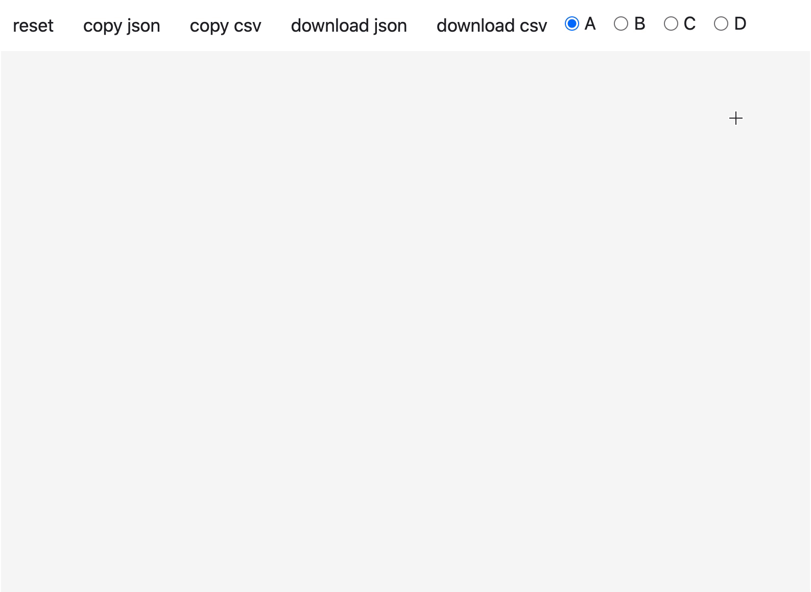

# Draw-new-datapoints-using-drawdata

If you want to create your own data points to play around it and want to apply different-different algorithms for understanding their working.

# drawdata
This small python app allows you to draw a dataset in a jupyter notebook. This should be very useful when teaching machine learning algorithms.

## Installation
Installation occurs via pip.

"python -m pip install drawdata"

## Import libaries and load object 
"from drawdata import draw_scatter

draw_scatter()"
